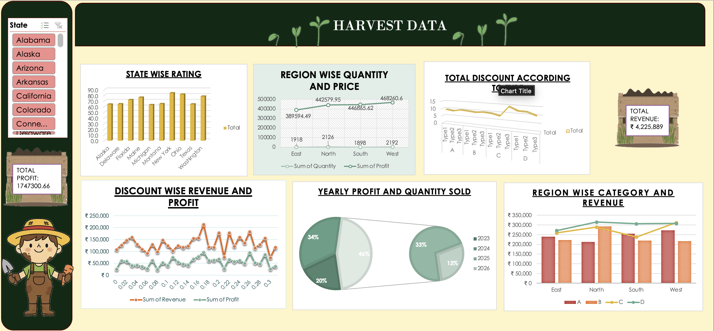

# Harvest Data Dashboard

 ## Project Overview
This project is an interactive Excel dashboard designed to analyze harvest data across different states and regions. It provides insights into revenue, profit, discounts, ratings, and regional performance through dynamic visualizations.

## Dataset
The dataset used in this project includes harvest-related information such as state, region, category, quantity, revenue, profit, discounts, and ratings.

## Tools Used
- Microsoft Excel
- Pivot Tables
- Pivot Charts
- Slicers
- Conditional Formatting

## Dashboard Preview
The dashboard below shows the final Excel dashboard developed for harvest data analysis.

## Key Insights
- State-wise Rating Analysis
- Region-wise Quantity and Price
- Discount-wise Revenue and Profit
- Total Revenue and Total Profit KPIs
- Yearly Profit and Quantity Sold
- Region-wise Category and Revenue

## Files 
- Harvest_Data_Dashboard.xlsx
- Harvest_Data_Dashboard.png

## License
This project was developed for educational and portfolio purposes.
